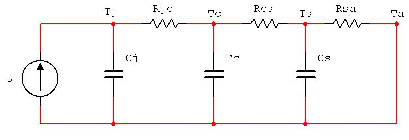
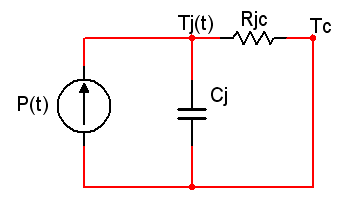
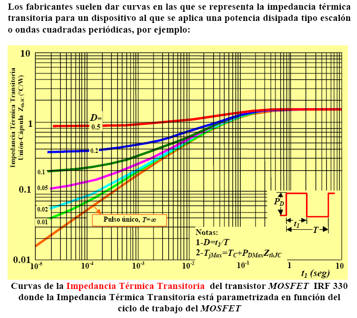

# **Ejercicio resuelto sobre el disipador necesario en un Semiconductor trabajando en régimen permanenete con un puslo único de sobrecorriente.**

**Un dispositivo de electrónica de potencia se puede representar de manera genérica como un interruptor, ya que estos dispositivos semiconductores trabajan generalmente entre sus estados estremos de corte y conducción. La Figura1 refleja de manera general el circuito equivalente de funcionamiento de uno de estos dispositivos.**

**En su modo normal de funcionamiento se encontrará sometido a unas condiciones de tensión y corriente como las especificadas en la Figura 2. En esta Figura 2, cuando el interruptor se encuentra cerrado soporta una tensión, $$V_{ON}$$, y una corriente, $$I_{ON}$$, iguales a $$2\;V$$ y $$20\;A$$ respectivamente. Sin embargo, cuando el interruptor se encuentra abierto suporta una tensión, $$V_{OFF}$$ y una corriente, $$I_{OFF}$$, con valores de $$60\;V$$ y $$0\;A$$. Los tiempos de conmutación del disposítivo $$t_1$$ y $$t_2$$ son iguales a $$1\;\mu s$$. Su frecuencia de operacion es de $$50\;kHz$$ y el ciclo de trabajo, $$D$$ de $$0,5$$.**

  

Figura 1. – Circuito electrónico con interruptor trabajando en modo on-off pulsante.
 

  

Figura 2. – Formas de onda de la conmutación.

**La temperatura máxima de trabajo que suporta el semiconductor, $$(T_J)_{MAX}$$ es de $$150^{\circ}C$$, su constante de tiempo unión-capsula, $$\tau$$, es igual a $$2\;ms$$ y las resistencias térmicas unión-cápsula, $$R_{JC}$$, y cápsula-disipador, $$R_{CS}$$, son $$1^{\circ}C/W$$ y $$0,2^{\circ}C/W$$, respectivamente**

**Se pide determinar el disipador requirido para que dicho componente semiconductor pueda soportar un pulso de sobrecorriente de $$200\;A$$ como el representado en la Figura 3.**

  

Figura 3. – Formas de onda de la conmutación en situación de sobrecorriente.

La teoría asociada a la solución de este problema está relacionada con la teoría mostradad en el documento que trata sobre la situación del pulso [Pulso único](docs/teoriaPulsoUnico.md).

La potencia media disipada por el componente esta formada por pontencia perdida durante la conducción y durante la conmutación. Expresiones que vienen explicadas en la resolución del [ejercicio del comportamiento de un semiconductor en régimen permanente](docs/EjerciciosResueltos/regimenPermanente.md).

La potencia media total disipada en régimen normal de operación viene determinado por la expresión: 
$$P=D \cdot I_{ON} \cdot V_{ON}+\frac 16 \cdot V_{OFF} \cdot f \cdot(t_1+t_2)\;\;\;(1)$$
Sustituyendo valores:
$$P=0,5 \cdot 20\;A \cdot 2\;V+\frac 16 \cdot 60V \cdot 50\;kHz \cdot(1\;\mu s+1\;\mu s)=20\;W+20\;W=40\;W\;\;\;(2)$$

Por otro lado, necesitamos calcular el calor de la potencia equivalente instantánea en conducciónpara el pulso único de sobrepotencia, $$P'_{ON}$$, el cual se obtiene de la expresión siguiente:

$$P'_{ON}=P_1+P_2+V_{ON}*I'_{ON}\;\;\;(3)$$

Donde $$P_1$$ y $$P_2$$ corresponden a las respectivas perdidas de conmutación en el instante en el que se produde la sobre potencia o sobrecorriente.

$$P'_{ON}=\frac {V_{OFF} \cdot I'_{ON}} {t_{ON}} \cdot \frac {t_1+t_2} {6} + V_{ON} \cdot I'_{ON}\;\;\;(4)$$

Sustituyendo los valores del enunciado del problema se obtiene:
$$P'_{ON}=\frac {60\;V \cdot 200\;A} {10\;\mu s} \cdot \frac {2\;\mu s} {6} + 2\;V \cdot 200\;A=800\;W\;\;\;(5)$$

Podemos concluir que debido a este pulso de sobrecorriente, de sobreconducción o de sobrepotencia, el semiconductor sufre un incremento de potencia calculado a continuación:

$$\Delta P = P'_{ON}-P = 800\;W-40\;W = 760\;W\;\;\;(6)$$

Para analizar el  comportamiento térmico a través del  modelo térmico eléctrico equivalente del conjunto dispositivo-disipador mostrado en la Figura 4.

  

Figura 4. – Circuito eléctrico equivalente a comportamiento térmico de un dispositivo.

Su poniendo una situación estática, estacionaria, considerando el la excitación un escalón de potencia P, el gradiente térmico unión-cápsila puede expresarse como sigue:
 $$(T_J)_{MAX} = P \cdot Z_{JC} \;\;\;(7)$$
Siendo $$Z_{JC}$$ la impedancia térmica transitorio unión-cápsula de pulso único.

Supuesto un pulso de sobrecorriente de corta duración, hablando en términos de electónica de potencia puede ser sinónimos; puede suponerse el efecto único de la capacidad referente al nodo de la unión, mientras que el resto de condensadores pueden considerarse cortocircuitados. Esta aproximación conlleva que la cápsula y el disipador permanecen a temperatura ambiente, aproximación que resulta consecuente con la inercia térmica de estas regiones. En estas condiciones el sistema se rige por la expresión:
$$Z_{JC}=_R{JC} \cdot (1-e^{-\tau\;/\;t})\;\;\;(8)$$
Siendo los valores de la constante de tiempo $$\tau$$ inferiores a $$1\;s$$ típicamente para componentes de alta potencia.

El circuito equivalente se muestra en la Figura 5. **Errata en la figura $$T_C$$ debe ser $$T_A$$**

  

Figura 5. – Circuito eléctrico equivalente a comportamiento térmico de un dispositivo.

Relacionando la expresión obtenida en $$(8)$$ con el gradiente térmico máximo, $$(T_{JC})_{MAX}$$, que se corresponde con la temperatura máxima en la unión, $$(T_J)_{MAX}$$, se puede establecer un valor límite de potencia $$P_{LIM}$$ de un pulso de corta duración. Esta potencia límite viene dada por la expresión:
$$P_{LIM}=\frac {(T_{JC})_{MAX}} {Z_{JC}(t_{ON})}=\frac {(T_J-T_C} {Z_{JC}(t_{ON})}\;\;\;(9)$$

La situación en la que se puede producir esta sobrecorriente o sobre conducción no es la más habitual, es decir, generalmente la sobreconducción no se dará en una situación en la que el dispositivo no está trabajando y sufre un primer ciclo de trabajo de este tipo. Lo usual es que el dispositivo se encuentre trabajando en su régimen de conmutación normal y esta sobrecorriente se superponga a la situación normal de funcionamieno o situación de régimen permanente.

En estas condiciones la temperatura de la cápsula, $$T_C$$, puede considerarse constante e inaltedara por el transitorio. Esto implica que el incremento térmico asociado al incremento de potencia $$\Delta P$$ quedan restringidas a la únion. Esta situación, como ya se ha citado, puede considerarse como la superposición a un régimen permanente. De esta manera, las situaciones correspondientes a la unión y al resto del sistema se describen mediante los circuitos presentados en las Figuras 6 y 7, respectivamente, siendo $$\Delta P$$ el incremento de potencia y $$P$$ la potencia media en el semiconductor en régimen permanente de operación normal.

  

Figura 6. – Circuito eléctrico equivalente unión cápsula asociado a una sobrecorriente.

  

Figura 7. – Circuito eléctrico equivalente asociado a los valore medios.

Por otro lado, en lo que se refiere a la potencia límite, $$\Delta P_{LIM}$$, asociada a la máxima variación del gradiente térmico unión-cápsula, ésta resulta determinada por el margen entre la temperatura de la unión correspondiente a la operación en régimen permanente, $$T_J$$, y su valor máximo $$(T_J)_{MAX}$$. Este incremento de potencia límite se determina a través de la siguiente expresión:
$$\Delta P = \frac {(T_J)_{MAX}-T_J} {Z_{JC}(t_{ON})} \;\;\;(10)$$

Entonces, el cálculo de disipador necesario para la especificaciones del problema pasa por sustituir los valores del problema a las ecuaciones vistas anteriormente.

Se calcula el valor de la impedancia transitoria de pulso único, $$Z_{JC}(t_{ON})$$:
$$Z_{JC}(t_{ON}=10\;\mu s)=2^{\circ}C/W \cdot (1-e^{-t_{ON}/{\tau}})=R_{JC}\cdot (1-e^{-10\;\mu s/{2\;ms}})\approx 0,01^{\circ}C/W\;\;\;(11)$$

Una vez obtenido el valor de la impedancia térmica transitoria, la temperatura media de la unión se obtiene a través de la expresión de potencia límite.
$$T_J=(T_J)_{MAX}-\Delta P \cdot Z_{JC}(t_{ON})=150^{\circ}C-0,01^{\circ}C/W\cdot 760\;W \approx 142^{\circ}C\;\;\;(12)$$

Una vez calculada la temperatura media de la unión, la resistencia térmica del disipador se calcula a partir del análisis del curcuito de la Figura 7.
$$P=\frac {T_J -T_A}{R_{JA}} =\frac {T_J -T_A}{R_{JC}+R_{JS}+R_{SA}}=\frac {142^{\circ}C-30^{\circ}C}{2^{\circ}C/W+0,2^{\circ}C/W+R_{SA}}=40\;W\;\;\;(13)$$

Despejando $$R_{SA}$$, se obtiene $$R_{SA}=0,6^{\circ}C/W$$

Con el valor calculado la temperatura que alcanzaría la unión durante el proceso transitorio descrito en la Figura 3, sería la temperatura máxima de la unión. Para garantizar el correcto funcionamiento del dispositivo y por ende del sistema, el valor de resistencia termica $$R_{SA}$$ debe ser inferior al valor calculado con el fin de garantizar que el semiconductor no alcanza su temperatura máxima de trabajo.

Por otro lado, para la resolución de este problema, en la parte referente al calculo de la impedancia termica transitoria unión-cápsula de puso único se puede determinar por procedimientos gráficos, en lugar del método analítico aquí presentado. 

Para ello los fabricantes proporciona curvas de impedancia termica $$Z_{JC}(t_{ON},D)$$, relativas a la corresponiente resistencia termica $$R_{JC}$$, normalizadas a la unidad. tomando como parámetro de trabajo el ciclo de trabajo, $$D$$ del dispositivo. Estas curvas se presentan en la Figura 8. Para el caso de pulso único el ciclo de trabajo es igual a cero, $$D=0$$.

  

Figura 8. – Impedancia térmica transitoria unión-cápsula del pulso y ciclo de trabajo.

Buscando en la gráfica para el valor de ciclo de trabajo y el tiempo en activo $$t_{ON}$$ el valor de la relación $$Z_{JC}/R_{JC}$$. Para este caso concreto:
 $$\frac {Z_{JC}(10\;\mu s)}{R_{JC}}=0,005 \;\Rightarrow \; Z_{JC}(10\;\mu s)=0,005\cdot 2^{\circ}C/W=0,01^{\circ}C/W \;\;\;(14)$$

## Referencias
1.	V. Fernández, F.J. Pérez, C. Bernal, “Electrónica de Potencia: Teoría, Problemas y Prácticas”. Servicio de Universidad de Zaragoza.
2.	A. Barrado, A. Lázaro, “Problemas de Electrónica de Potencia”. Pearson, 2007 