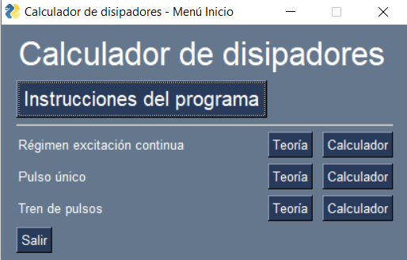

# Manual de Usuario del Programa Calculador de Disipadores (CdD)

>El presente documento contiene las instrucciones necesarias para el uso de la **aplicación Calculo de Disipadores (CdD)**, que sirve para calcular disipadores térmicos y para averiguar la sobrepotencia máxima que soportará un circuito integrado. Este cálculo se encuentra fuertemente ligado a la Electrónica de Potencia.

El código del software, así como todos los documentos asociados se encuentran en el siguiente repositorio en Github: https://github.com/dantolin-zgz/CalculadorDisipadores/. Todo el conjunto se encuentra bajo una licencia . El código de la aplicación se está desarrollado en Python para que la aplicación sea multiplataforma y pueda ser utilizada tanto en sistemas operativos Windows, Linux o MAC.

El conjunto de lo anteriormente comentado convierte a la aplicación en un Recurso Educativo en Abierto (REA), Open Educative Resource (OER), en inglés. Esto está alineado con los siguientes [Objetivos de Desarrollo Sostenible (ODS) de la Agenda 2030 de Naciones Unidas](https://www.un.org/sustainabledevelopment/es/), contribuyendo en cierta medida a su logro número 4: **Educación de calidad.** Concretamente en los siguientes puntos:
* **4.3 Asegurar el acceso igualitario a la formación superior:** De aquí a 2030, asegurar el acceso igualitario de todos los hombres y las mujeres a una formación técnica, profesional y superior de calidad, incluida la enseñanza universitaria.
* **4.4 Aumento de las competencias para acceder al empleo:** De aquí a 2030, aumentar considerablemente el número de jóvenes y adultos que tienen las competencias necesarias, en particular técnicas y profesionales, para acceder al empleo, el trabajo decente y el emprendimiento.

A continuación, se van a presentar y explicar el uso de los diferentes menús, comenzando por el menú principal.

## MENÚ PRINCIPAL.
La Figura 1 muestra el menú principal. Desde el menú se puede acceder directamente a este mismo documento pulsando el botón Instrucciones del programa.

 
 

Figura 1. – Menú Principal

Desde este menú se puede acceder a las diferentes funcionalidades de la aplicación. Comenzaremos explicando para que sirven los diferentes menús disponibles en el menú. 

En primer lugar, el botón Salir cierra la aplicación.

Además de los botones Instrucciones del programa y Salir existen otros 6 botones. Cada  pareja de ellos (Teoría-Calculador) se encuentra etiquetada con un texto que hace referencia a los diferentes modos de operación (régimen de excitación continua, pulso único y tren de pulsos) en los que se puede encontrar un dispositivo electrónico (circuito integrado) para el que queremos calcular cuál es la resistencia térmica disipador-ambiente –resistencia térmica del disipador– necesaria para que éste opere dentro de sus límites térmicos.

Cada uno de los botones Teoría permiten acceder al documento que contiene la teoría asociada al modo de operación referenciado por la etiqueta. El documento se lanza sobre la aplicación para la lectura de documentos pdf que el usuario tenga instalada en su ordenador. Cada documento contiene la teoría/información necesaria para comprender los conceptos relacionados con el cálculo de disipadores y en los diferentes regímenes de funcionamiento.

Al lanzarse el documento frente al programa instalado por el usuario, la aplicación CdD queda en un segundo plano, de manera que el usuario pueda consultar la documentación necesaria y continuar utilizando CdD al mismo tiempo.
Los documentos de teoría tienen el siguiente aspecto:

[![This is an image] (../assets/img/Fig2.png)] 

 

Figura 2. – Ejemplo de documento pdf con contenido teórico.

Por último, cada uno de los botones Calculador lanzan una nueva ventana asociada a cada uno de los modos de operación donde se recogerán los datos necesarios para la realización del calculo que permite obtener el valor de la resistencia térmica del disipador necesaria para un dispositivo, así como la sobrepotencia máxima que puede soportar un circuito integrado dependiendo de su régimen de funcionamiento.

A continuación, se explican detalladamente los menús que aparecen para el cálculo en los diferentes modos de operación.
