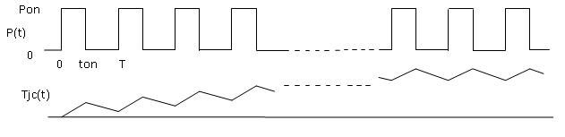
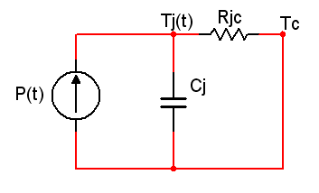
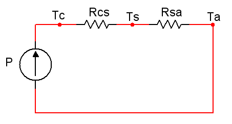

 
# ***Ejercicio resuelto sobre el disipador necesario en un Semiconductor trabajando como interruptor en un tren de pulsos.***

**Un dispositivo de potencia representado por el interruptor S mostrado en la Figura 1 se somete a un proceso de conmutación del tipo indicado en la Figura 2. Cuando el dispositivo se encuentra conduciendo suporta una tensión $V_{ON}$ y una corriente $I_{ON}$ iguales a $2\;V$ y $20\;A$, respectivamente , mientras que cuando éste se encuentra en un estado de corte soporta una tensión $V_{OFF}$ y una corriente $I_{OFF}$ iguales a $60\;V$ y $0\;A$, respectivamente. Los tiempos de conmutación del dispositivo $t_1$ y $t_2$ son igual a $1\;\mu s$; su frecuencia de conmutación, $f_S$, es $50\;kHz$ y su ciclo de operación ,$D$, es $0,5$. La temperatura máxima de la unión que suporta el dispositivo $T_{Jmax}$ es $150^{\circ}C$; su cnstante de tiempo térmica unión-cápsula, $\tau$, es de $20\;ms$, y sus resistecncias térmicas unión-cápsula, $R_{JC}$ y cápsula disiador, $R_{CD}$, son $1^{\circ}C/W$ y $0,2^{\circ}C/W$, respectivamente.**

**Determinar:**
1. **Potencia media total en el interruptor.**
2. **Potencia instantánea en conducción, suponiendo una conmutación ideal.**
3. **Temperatura de la cápsula y disipador requerido para una correcta operación del dispositivo, suponiendo una temperatura ambiente de $30^{\circ}C$.**
4. **Apartados anteriores para una frecuandia de operación de $50\;Hz$.**

  

Figura 1. – Circuito de Electrónica de Potencia a analizar.

  

Figura 2. – Proceso de conmutación al que se encuentra somido el dispositivo semiconductor en terminos de tensión y corriente.

# **Solución**
## **Apartado 1) Potencia media total en el interruptor.**
La potencia media disipada por el dispositivo en conmutación, por el interruptor se puede expresar como la suma de la pontencia media en conducuón más la potencia media en los procesod de conmutación, como muestra la siguiente expresión:
$$P=P_{ON}+P_1+P_2  \;\;\;(1)$$

siendo $P_{ON}$, $P_1$ y $P_2$ los valores medios correpondientes al régimen permanenete en conducción y, como ya s e ha dicho anteriormente, a los dos procesos transitorios de conmuntación de ($OFF \rightarrow ON, ON \rightarrow OFF$).

Las potencias $P_1$ y $P_2$ disipadas por el interruptor durante los transistorios de conmutación corresponden a las siguiente expresiones:

$$ P_1=\frac 1 {T_S} \cdot \int_0^{t_1} v_S \cdot i \cdot dt \approx \frac 1 {T_S} \cdot \int_0^{t_1} V_{OFF} \cdot (1- \frac t t_1 \cdot) \cdot I_{ON} \cdot \frac t t_1 \cdot dt= \frac {V_{OFF} \cdot I_{ON}} 6 \cdot \frac {t_1} {T_S} \;\;\;(2)$$

$$ P_2=\frac 1 {T_S} \cdot \int_0^{t_2} v_S \cdot i \cdot dt \approx \frac 1 {T_S} \cdot \int_0^{t_2} V_{OFF} \cdot \frac t t_2 \cdot (1- \frac t t_2 \cdot) \cdot I_{ON} \cdot \frac t t_2 \cdot dt= \frac {V_{OFF} \cdot I_{ON}} 6 \cdot \frac {t_2} {T_S} \;\;\;(3)$$

De la misma manera, la expresión de la potencia disipada por el interruptor en régimen permanante de conducción, $P_{CON}$, es la siguiente:

$$ P_{CON} = \frac 1 {T_S} \cdot \int_0^{t_{ON}} V_{ON} \cdot I_{ON} \cdot dt = D \cdot V_{ON} \cdot I_{ON} \;\;\;(4)$$

Sustituyendo las ecuaciones anteriores 2,3 y 4 en la expresión uno se obtiene:
$$ P=D \cdot V_{ON} \cdot I_{ON} + \frac {V_{OFF} \cdot I_{ON}} 6 \cdot f_S \cdot (t_1+t_2) \;\;\;(5)$$

Finalmente sustityendo los valores proporcionados en el enunciado se obtiene:
$$ P=D \cdot V_{ON} \cdot I_{ON} + \frac {V_{OFF} \cdot I_{ON}} 6 \cdot f_S \cdot (t_1+t_2) = 0,5 \cdot 2\;V \cdot 20\;A + \frac {60\;V \cdot 20\;A} 6 \cdot 50kHz \cdot 2 {\mu}s = 20\;W + 20\;W = 40\;W \;\;\; (6)$$

Es importante destacar y hacer incapié en la importacia que presentan la potencia asociada en los dispositvos semiconductores que trabajan como interruptores durante los procesos de conmutación. Podemos ver en este ejemplo que el valor de la potencia disipada en el semiconductor en las conmutaciones es la misma que durante el proceso de conducción.

## ***Apartado 2) Potencia instantánea en conducción, suponiendo una conmutación ideal.***

En el caso de estudio que se corresponde con un tresn de pulsos repetitivo, la aproximación ideal de la onda de potencia supone incluir en el valor de régimen permanente de conducción la contribución de los transistores de conmutación, es decir, llevar la onda de estudio a una onda cuadrada de potencia ideal. A este valor de potencia en conducción lo llamaremos potencia instantane equivalente en conducción $P_{ON}$ lo cual se relaciona con la potencia media a traves del ciclo de operación D de la siguiente forma:
$$ P=\frac 1 {T_S} \cdot \int_0^{t_{ON}} P_{ON} \cdot  dt= D \cdot P_{ON} \;\;\;(7)$$
Donde $P$ es la potencia resultante de los términos estacionarios y de conmutación, es decir, el valor obtenido en el apartado anterior.

Por tanto, la situación presentada en el apartado anterior resulta equivalente a otra ideal, donde la potencia disipada en conmutación es nula la potenia disipada durante el intervalo de conducción coincide con $P_{ON}$.

La potencia en conducción equivalente para una conmutación ideal en el caso que nos otupa será:
$$P_{ON}= \frac D P = \frac {40W} {0,5} = 80\;W \;\;\;(8)$$

La forma de onda correspondiente a la conmutación ideal en terminos de potencia se representa en la Figura 3.

  

Figura 3. – Forma de onda de potencia ideal equivalente de potencia.

## **Apartado 3) Temperatura de la cápsula y disipador requerido para una correcta operación del dispositivo, suponiendo una temperatura ambiente de $30^{\circ}C$.**
Para la resolver este apartado es necesario comprender el modelo térmico eléctrico equivalente del conjunto dispositivo-didipador mostrado en la Figura 4.

  

Figura 4. – Circuito eléctrico equivalente a comportamiento térmico de un dispositivo.

La teoría asociada se encuentra en el docuemento sobre [Tren de Pulsos](docs/teoriaTrenPulsos.md).

Como en dicho documento se indica, en el caso de un tren de pulsos repetitivo el comportamiento del circuito de la Figura 4, puede explicarse mediante un proceso repetitivo de Carga-Descarga de las capacidades del circuito equivalente. Esto es debido a que los condensadores se encuentran representando la incercia térmica propia de los elementos del sistema al incremento de temperaturas, y puesto que, esta incercia aumenta con la superficie de las zonas que soportan la progración del calor, la capacidad asociadad al nodo de la unión será la de menor valor del circuito. 

Dicho proceso de Carga-Descarga de las capacidades del circuito equivalente se corresponde con los intervalos de calentamiento y enfriamiento, respectivamente de modo que el gradiente térmico Unión-Capsula, $T_{JC}$, va incrementandose hasta estabiliczarse en un valor de régimen permanente con sucesivas fluctuaciones en torno a un valor medio, como se puede ver en la Figura 5.

  

Figura 5. – Comportamiento térmico de un integrado frente a un tren de pulsos.
 

El valor medio del gradiante térmico puede ser poco relevante si las fluctuaciones térmicas son importantes, por eso resulta de especial interes determinar el valor máximo correspondiente.

Las capacidades térmicas de la cápsula y del disipador son mucho mayores por lo que sus variaciones térmicas se pueden despreciar, lo que permite aproximar los condensadores asociados a cortocircuitos para todos los armónicos de la onda de excitación, mientras que actúa como un circuito abierto ante una excitación continua. De esta manera, se puede suponer que la capápsula y el disipador tienen una temperatura fija., mientras que las fluctuaciones quedan restringidas a la zona de la unión. Como consencuencia directa el sistema se puede representar mediante sendos circuitos equivalentes, representados en las Figuras 6 y 7, respectivamente, siendo $p(t)$ la onda rectangular de potencia y $P$ su valor medio.

  

Figura 6. – Circuito eléctrico equivalente de la componente incrementar referente al comportamiento térmico de un dispositivo.
 

  

Figura 7. – Circuito eléctrico equivalente de la componente en régimen permanente del comportamiento térmico del dispositivo.

## **Apartado 4) Apartados anteriores para una frecuandia de operación de $50\;Hz$.**
