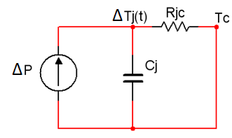

# Impedancia térmica transitoria (Pulso único)
El modelo de conducción térmica caracterizado por un circuito puramente resistivo, solamente es válido con una excitación estática en régimen permanente y se corresponde con la situación de equilibrio térmico entre el flujo de calor generado en el interior y el que se propaga hacia el exterior. La inercia propia del sistema a la elevación de temperaturas, con el consiguiente proceso transitorio de propagación, puede caracterizarse mediante la inclusión de condensadores en el correspondiente circuito térmico equivalente. 

  

Figura 1. – Circuito electrónico equivalente al comportamiento térmico.
 

 La inercia térmica aumenta con la superficie de las zonas que soportan el flujo de propagación, por lo que la capacidad asociada al nudo de la unión será de menor valor que las restantes del circuito.

La cápsula y el disipador presentan fuertes inercias a variaciones de temperatura por lo que la cápsula y el disipador permanecen a temperatura ambiente, $$T_a$$, en el caso de pulso único.

De acuerdo con el teorema de superposición, cualquier variable de un circuito se expresa en el campo transformado como la superposición de los generadores independientes, las temperaturas de la unión y de la cápsula, así como su diferencia, vendrán dadas por:

$$T_j(s)=P(s) \cdot Z_j'(s); \quad Tc(s)=P(s)\cdot Z_c'(s)$$
$$T_j(s)-T_c(s)=P(s)\cdot [Z_j'(s)-Z' c(s)]$$
$$T_{jc}(s)=P(s)\cdot Z_{jc}'(s)$$

Donde $$Z_{jc}'(s)$$ es la impedancia térmica operacional.
Suponiendo una excitación estática, la situación puede expresarse de la forma:

$$
P(s)=\frac{P}{S}; \quad T_{jc}(s)=P \cdot \frac{Z_{jc}'(s)}{S}
$$
$$T_{jc}(t)=P \cdot £^{-1}\frac{Z_{jc}'(s)}{S}=P \cdot Z_{jc}(t)
$$

Donde $$P=P_{on}$$, potencia en el nivel alto del pulso y $$Z_{jc}(t)$$ es la **impedancia térmica transitoria unión-cápsula de pulso único**.
Para un pulso de larga duración, puede considerarse el efecto único de la capacidad térmica asociada a la unión, dado su menor valor, mientras que los otros condensadores pueden suponerse cortocircuitos, lo que significa admitir que la cápsula y el posible disipador permanecen a temperatura ambiente, consecuentemente con la inercia propia de estas regiones. En estas condiciones el sistema resulta de primer orden, con lo cual:

$$
Z_{jc}=Z_{jc}(t)=R_{jc}(1-e^{-t_{on}⁄\tau})
$$
$$
T_{jc}(t)=P \cdot Z_{jc}(t)=P \cdot R_{jc}(1-e^{-t_{on}⁄\tau} )

  

Figura 2. – Circuito transitorio eléctronico equivalente.
 

El gradiente térmico unión-cápsula tiende al valor de régimen permanente $$P \cdot R_{jc}$$, de acuerdo con el modelo de circuito resistivo, siendo valores típicos de la constante de tiempo esencialmente inferiores a 1s en componentes de alta potencia. En relación con la expresión anterior, el gradiente térmico máximo unión-cápsula, $$(T_{jc})_{\max}$$, correspondiente a la temperatura máxima de la unión, $$(T_{j})_{\max}$$, establecerá el límite de potencia $$P_{\text{lim}}$$, de pulso de duración $$t_{on}$$:

$$
P_{\text{lim}}=\frac{(T_{jc})_{\max}}{Z_{jc}(t_{on})}=\frac{(T_{j})_{\max}-T_a}{Z_{jc}(t_{on})}>\frac{(T_{j})_{\max}-T_a}{R_{jc}}=P_{\max}
$$
$$
t_{on}\ll\tau \rightarrow Z_{jc}(t_{on})\approx R_{jc}(t_{on}/\tau)
$$
$$
P_{\text{lim}}=\frac{\tau}{t_{on}}\frac{(T_{j})_{\max}-T_a}{R_{jc}}=\frac{\tau}{t_{on}}P_{\max} \gg P_{\max}
$$

Siendo $$P_{\max}$$ la potencia máxima en operación continua.

  

Figura 3. – Circuito eléctronico equivalente para el incremento en la disipación de potencia.
 

Por consiguiente, para tiempos de conducción ($$t_{on}\ll\tau $$), el hecho de que la impedancia térmica resulte muy inferior al valor de la correspondiente resistencia, $$Z_{jc}(t_{on}) \ll R_{jc}$$, determina que la potencia disipada pueda ser bastante mayor que el valor máximo en régimen de operación continua, sin que ello suponga la elevación de la temperatura de la unión por encima de su valor máximo, $$(T_{j})_{\max}$$, lo que supondría la destrucción del componente.

Sin embargo, el caso más habitual de pulso único de corta duración e intensidad elevada corresponde a un proceso transitorio superpuesto a una situación de conducción limitada. Análogamente a la situación analizada con anterioridad, la temperatura de la cápsula, $$T_c$$, puede suponerse inalterada por el transitorio, por lo que las variaciones térmicas asociadas a un incremento de potencia $$\Delta P$$ quedan restringidas a la unión, de modo que puede considerarse como superposición a un régimen permanente.
 
Por consiguiente, la disponibilidad límite de potencia, $$\Delta P_\text{lim}$$, asociada a la máxima variación del gradiente térmico unión-cápsula, resulta determinada por el margen entre la temperatura de la unión correspondiente al proceso permanente, $$T_j$$, y su valor máximo $$(T_{j})_{\max}$$, de la forma:

$$
\Delta(T_{jc})_{\max}=\Delta(T_{j})_{\max}-T_c=(T_{j})_{\max}-T_j=\Delta P_\text{lim}\cdot Z_{jc}(t_{on})
$$
$$
\Delta P_\text{lim}=\frac{(T_{j})_{\max}-T_j}{Z_{jc}(t_{on})}
$$

De modo que esta expresión coincide con la correspondiente a una conducción de pulso único, situación con anterioridad, sin más que hacer $$T_j=T_a$$.
Se deduce, pues, que la posibilidad de soportar picos importantes de potencia es función tanto de la impedancia térmica transitoria de pulso único, $$Z_{jc}$$, cuya dependencia temporal es dada por el fabricante, como del hecho de establecer una operación permanente con una temperatura de la unión, $$T_j$$, esencialmente inferior a su valor máximo.

## Referencias
1.	V. Fernández, F.J. Pérez, C. Bernal, “Electrónica de Potencia: Teoría, Problemas y Prácticas”. Servicio de publicaciones Universidad de Zaragoza.
2.	A. Barrado, A. Lázaro, “Problemas de Electrónica de Potencia”. Pearson, 2007 

